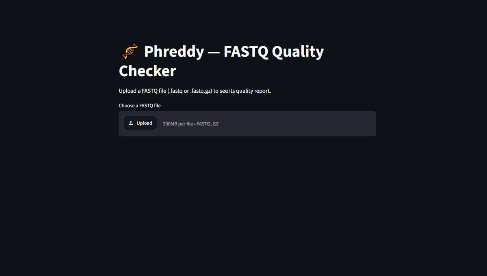
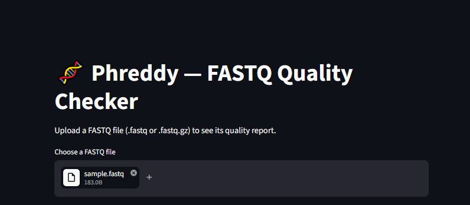
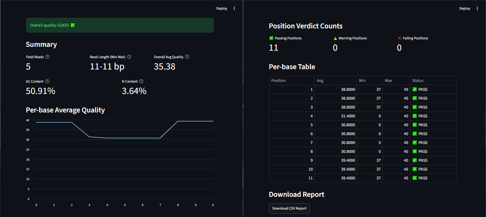
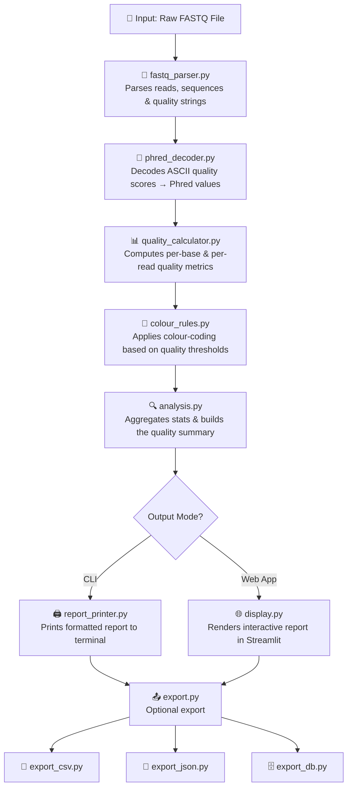

<div align="center">

# 🧬 Phreddy

### A fast, no-fuss FASTQ quality inspection tool for NGS reads

*Command-line power meets an interactive web interface — built from scratch, dependency-light, and ready to plug into your pipeline.*

**Built from scratch. Zero bloat. Just clean, transparent FASTQ QC.**

🔬 Built from the ground up — parser, decoder & quality engine, no hidden libraries<br>
⚡ Run it first, before FastQC, Trimmomatic & alignment<br>
🐍 Simple Python underneath, a clean Streamlit interface on top

</div>

---

## 📖 Table of Contents

- [✨ Overview](#-overview)
- [📸 Screenshots](#-screenshots)
- [🚀 Features](#-features)
- [🛠️ Tech Stack](#️-tech-stack)
- [🔄 How Phreddy Works](#-how-phreddy-works)
- [🧠 Design Notes](#-design-notes)
- [🗂️ Project Structure](#️-project-structure)
- [⚙️ Installation](#️-installation)
- [🖥️ Usage](#️-usage)
- [🧪 Sample Data](#-sample-data)
- [🗺️ Roadmap](#️-roadmap)
- [🤝 Contributing](#-contributing)
- [📄 License](#-license)

---

## ✨ Overview

**Phreddy** parses raw FASTQ files and generates quality reports based on Phred scores, helping you quickly assess read quality before moving into downstream NGS steps like trimming and alignment. It's built to be simple, fast, and lightweight — no heavyweight bioinformatics suite required for a first-pass QC check. 🧪

---

## 📸 Screenshots

**1. Landing page — first view on opening the app**

 

**2. Uploading a FASTQ file**

 
 
**3. Generated quality report**



---

## 🚀 Features

- 🧬 FASTQ parsing built from scratch — no external parsing libraries
- 🔢 Phred score decoding and per-base / per-read quality calculation
- 🎨 Colour-coded quality visualization for instant interpretation
- 📤 Exportable reports in **CSV**, **JSON**, and **database** formats
- 💻 CLI for quick terminal-based checks
- 🌐 Streamlit web interface for interactive exploration
- 🖨️ Clean, printable/formatted quality reports

---

## 🛠️ Tech Stack

- 🐍 **Python 3.13**
- 🌐 **Streamlit** — web interface
- 🧬 Custom-built FASTQ parser, Phred decoder, and quality calculator — no external bioinformatics libraries used

---

## 🔄 How Phreddy Works



**Step-by-step:**

1. **Input** — You provide a `.fastq` file, either via CLI argument or upload through the web app.
2. **Parsing** — `fastq_parser.py` reads the file and splits it into individual records (header, sequence, `+`, quality string).
3. **Decoding** — `phred_decoder.py` converts each ASCII quality character into its numeric Phred score.
4. **Quality Calculation** — `quality_calculator.py` computes metrics like average quality per base position and per read.
5. **Colour Coding** — `colour_rules.py` assigns colours (e.g. green/yellow/red) based on quality thresholds, making problem regions easy to spot visually.
6. **Analysis** — `analysis.py` aggregates everything into a summary — overall read quality, flagged low-quality reads, etc.
7. **Output** — Depending on how you're running Phreddy:
   - **CLI** → `report_printer.py` prints a clean formatted report straight to your terminal.
   - **Web App** → `display.py` renders the same data as an interactive Streamlit dashboard.
8. **Export (optional)** — Save your results as CSV, JSON, or push to a database via `export_csv.py`, `export_json.py`, or `export_db.py`.

---

## 🧠 Design Notes

A few decisions behind how Phreddy is built:

- **No black-box parsing** — the FASTQ parser, Phred decoder, and quality engine are all hand-written, so every score you see can be traced back to readable code, not an opaque library call.
- **Modular by design** — parsing, decoding, calculation, visualization, and export each live in their own file. Swap or extend any one piece without touching the rest.
- **Two interfaces, one core** — the CLI and Streamlit app both run through the same underlying logic, so results stay consistent whether you're scripting or clicking.
- **Minimal dependencies** — outside of Streamlit and Pillow, there's nothing riding on external bioinformatics packages, keeping the install light and the codebase easy to audit.

---

## 🗂️ Project Structure

```
Phreddy/
├── main.py                 # 🚪 CLI entry point
├── app.py                  # 🌐 Streamlit web app entry point
├── phreddy.py               # ⚙️ Core application logic
├── fastq_parser.py          # 🧬 FASTQ file parsing
├── phred_decoder.py         # 🔢 Phred score decoding
├── quality_calculator.py    # 📊 Quality score computations
├── colour_rules.py           # 🎨 Colour-coding logic
├── analysis.py               # 🔍 Analysis routines
├── display.py                 # 🖥️ Web output formatting
├── report_printer.py         # 🖨️ CLI report generation
├── export.py                  # 📤 Export orchestration
├── export_csv.py              # 📄 CSV export
├── export_json.py             # 🧾 JSON export
├── export_db.py               # 🗄️ Database export
├── utils.py                    # 🧰 Shared utility functions
├── sample_data/
│   └── sample.fastq          # 🧪 Sample FASTQ file for testing
├── docs/
│   └── screenshots/           # 📸 App screenshots used in this README
├── requirements.txt           # 📦 Python dependencies
├── .gitignore                 # 🚫 Files/folders excluded from Git
├── LICENSE                    # 📄 MIT License
└── README.md                  # 📖 Project documentation
```

---

## ⚙️ Installation

**1. Clone the repository**

```bash
git clone https://github.com/<your-username>/Phreddy.git
cd Phreddy
```

**2. Create a virtual environment** *(recommended)*

```bash
python -m venv venv
venv\Scripts\activate
```

**3. Install dependencies**

```bash
pip install -r requirements.txt
```

---

## 🖥️ Usage

### 💻 CLI

```bash
python main.py sample_data/sample.fastq
```

### 🌐 Web App

```bash
streamlit run app.py
```

Then open the local URL shown in your terminal (usually `https://satvikparvbioinfo-png-phreddy-app-w6vrer.streamlit.app/).. upload a `.fastq` file, and watch your quality report come to life. ✨

---

## 🧪 Sample Data

A sample FASTQ file is included at `sample_data/sample.fastq` so you can test Phreddy immediately without needing your own dataset.

---

## 🗺️ Roadmap

- [ ] 📈 Per-position quality trend graphs
- [ ] 📦 Batch processing of multiple FASTQ files
- [ ] 🧫 GC content & adapter contamination detection
- [ ] 📦 Package as a pip-installable CLI tool

---

## 🤝 Contributing

Contributions, issues, and feature requests are welcome! Feel free to open an issue or submit a pull request. 🙌

---

## 📄 License

This project is licensed under the **MIT License**. See the [LICENSE](LICENSE) file for details.

<div align="center">

---

Made with 🧬 and ☕ by **Satvik**

</div>
